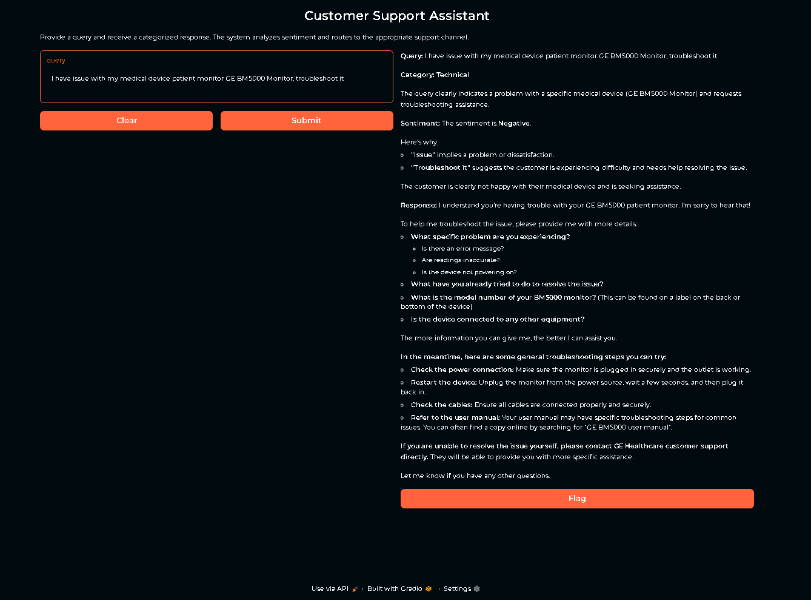

# Customer_Support_Agent_LangGraph
 Created an AI-Powered Customer Support Agent that leverages multi-agent systems and the versatility of LangGraph to revolutionize your customer interactions.

We are going to utilize **LangGraph** **LangChain** **LangSmith** **Groq model**

# First Step
1. Create new venv using 

```
conda create -n env python=3.12 -y

```
2. Activate the env 

```
conda activate env
```
3. Install the requirements.txt
```
pip install -r requirements.txt
```

# Second Step

1. Import required Libraries
2. Define a State and Model for our Project
3. Create a Nodes 
4. Build a Workflow and connect nodes with edges and compile it.
5. Visualize and Test the Pipeline


